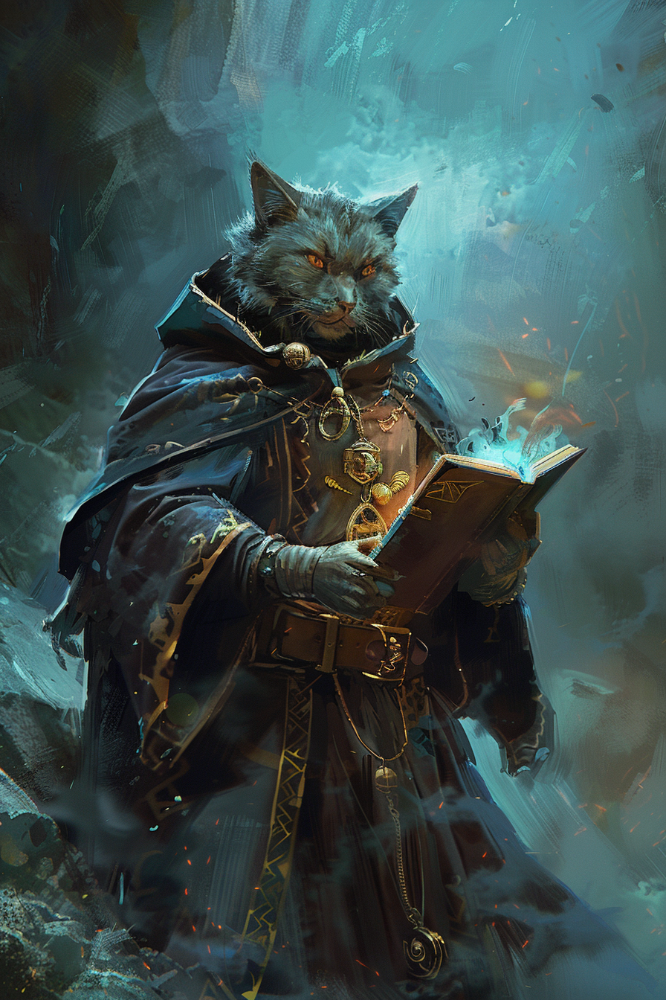

# Ayum Teeh

## Informations générales

| | | | |
|---|---|---|---|
| **Nom** | Ayum Teeh | **Niveau** | 2 |
| **Age** | 21 | **Classe** | Occultiste 2 |
| **Alignement** | Chaotic Neutral  | **Expérience** | 300 |
| |  | **Race** | Tabaxi |
| |  | **Bonus de maîtrise** | +2 |

| | | | |
|---|---|---|---|
| **HP actuels** | 15 | **HP Max** | 15 |
| **Dés de vie actuels** | 2d8 | **Dés de vie max** | 2d8  |
| **Emplacements de sort actuels** | 2 (level 1) | **Emplacements de sort max** | 2  |

## Caractéristiques de combat
| | |
|-|-|
|**Vitesse**|9m|
|**Vitesse d'escalade**|6m|
|**Vitesse de nage**|12m|

### Attaques
|Arme|Toucher|Dégâts|Portée|Formule Toucher|Formule Dégâts|
|-|-|-|-|-|-|
|**Griffes**|1d20+1|1d4-1 tranchants||1d20+FOR+PROF|1d4+FOR|
|**Armes d'hast**|1d20+1|1d8-1 contondants||1d20+FOR+PROF|1d8+FOR|
|**Dague**|1d20+5|1d4+3 tranchants|20/60|1d20+DEX+PROF|1d8+DEX|
|**Arbalète Légère**|1d20+5|1d8+3 perforants|20/60|1d20+DEX+PROF|1d8+DEX|

### Sorts
|Nom|Level|
|-|-|
|**Eldritch Blast**|Cantrip|
|**Prestidigitation**|Cantrip|

## Ability scores

| |Caractéristique|Modificateur| Jets de Sauvegarde |
|-|-|-|-|
|Force|**8**|**-1**|**-1**|
|Dextérité|**16**|**+3**|**+3**|
|Constitution|**13**|**+1**|**+1**|
|Intelligence|**12**|**+1**|**+1**|
|Sagesse|**10**|**+0**|**+2** (prof)|
|Charisme|**16**|**+3**|**+5** (prof)|

*Cat's Talent* - You have proficiency in the Perception and Stealth skills.

*Far Traveler* - You have proficiency in Insight and Perception.

Tromperie

Arcanes

## Traits
### Traits raciaux
*Darkvision* - You have cat's keen senses, especially in the dark. You can see in dim light within 12m of you as if it were bright light, and in darkness as if it were dim light. You can't discern color in darkness, only shades of gray.

*Feline Agility* - Your reflexes and agility allow you to move with a burst of speed. When you move on your tum in combat, you can double your speed until the end of the tum. Once you use this trait, you can't use it again until you move 0 feet on one of your turns.

### Traits de classe
#### Tentacle of the Deep
At 1st level, you can magically summon a spectral tentacle that strikes at your foes. As a bonus action, you create a 3m-long tentacle at a point you can see within 12m of you. The tentacle lasts for 1 minute or until you use this feature to create another tentacle.

When you create the tentacle, you can make a melee spell attack against one creature within 3m of it. On a hit, the target takes 1d8 cold damage, and its speed is reduced by 3m until the start of your next turn. 

As a bonus action on your turn, you can move the tentacle up to 9m and repeat the attack .

You can summon the tentacle a number of times equal to your proficiency bonus, and you regain all expended uses when you finish a long rest.

#### Gift of the Sea
You can breathe underwater.

### Maîtrises

| | |
|-|-|
|**Langues parlées**|Commun, Draconique, Goblin|
|**Instruments**|Chamisen|
|**Armures**|Légère|
|**Armes**|Armes courantes|
|**Outils**|Aucun|

## Inventaire
### Equipement
* Vêtements de voyageur
* Armure de cuir
* Chamisen

### Armes
* Armes d'hast (bâton)
* Arbalète légère et 20 carreaux
* 2 Dagues

### Objet
* Carte peu précise de Faerûn
* Anneau gravé, légué par son grand-père
* Bourse
* Arcane focus
* Sac à dos
* Livre d'histoire
* Plume et encre
* 10 parchemins
* Petit sac de sable
* Petit couteau

### Argent
5 pièces d'or 

## Background (Player Handbook)

### Texte introductif
Almost all of the common people and other folk that one might encounter along the Sword Coast or in the North have one thing in common: they live out their lives without ever traveling more than a few miles from where they were born.

You aren't one of those folk.

You are from a distant place, one so remote that few of the common folk in the North realize that it exists, and chances are good that even if some people you meet have heard of your homeland, they know merely the name and perhaps a few outrageous stories. You have come to this part of Faerûn for your own reasons, which you might or might not choose to share.

Although you will undoubtedly find some of this land's ways to be strange and discomfiting, you can also be sure that some things its people take for granted will be to you new wonders that you've never laid eyes on before. By the same token, you're a person of interest, for good or ill, to those around you almost anywhere you go.

### Otherwordly patron - Fathomless
You have plunged into a pact with the deeps. An entity of the ocean, the Elemental Plane of Water, or another otherworldly sea now allows you to draw on its thalassic power. Is it merely using you to learn about terrestrial realms, or does it want you to open cosmic floodgates and drown the world?

Perhaps you were born into a generational cult that venerates the Fathomless and its spawn. Or you might have been shipwrecked and on the brink of drowning when your patron's grasp offered you a chance at life. Whatever the reason for your pact, the sea and its unknown depths call to you.

Entities of the deep that might empower a warlock include krakens, ancient water elementals, godlike hallucinations dreamed into being by kuo-toa, merfolk demigods, and sea hag covens.

### Choix
*Raison du voyage* - Vagabond (désire voyager pour explorer le monde)
*Origine* - Île d'Alaron (au large de la Côte des Epées)

| | |
|-|-|
|**Personnalité**|I have different assumptions from those around me concerning personal space, blithely invading others' space in innocence, or reacting to ignorant invasion of my own.|
|**Idéaux**|*Adventure* - I'm far from home, and everything is strange and wonderful!|
|**Liens**|My freedom is my most precious possession. I'll never let anyone take it from me again.|
|**Défauts**|I don't take kindly to some of the actions and motivations of the people of this land, because these folk are different from me.|

### Autres
Your accent, mannerisms, figures of speech, and perhaps even your appearance all mark you as foreign. Curious glances are directed your way wherever you go, which can be a nuisance, but you also gain the friendly interest of scholars and others intrigued by far-off lands, to say nothing of everyday folk who are eager to hear stories of your homeland.

You can parley this attention into access to people and places you might not otherwise have, for you and your traveling companions. Noble lords, scholars, and merchant princes, to name a few, might be interested in hearing about your distant homeland and people.

## Histoire du personnage

## To be unlocked 

### Level 6
*Oceanic Soul* - At 6th level, you are now even more at home in the depths. You gain resistance to cold damage. In addition, when you are fully submerged, any creature that is also fully submerged can understand your speech, and you can understand theirs.

*Guardian Coil* - At 6th level, your Tentacle of the Deeps can defend you and others, interposing itself between them and harm. When you or a creature you can see takes damage while within 10 feet of the tentacle, you can use your reaction to choose one of those creatures and reduce the damage to that creature by 1d8. When you reach 10th level in this class, the damage reduced by the tentacle increases to 2d8.

### Level 10
*Tentacle of the Deep* - When you reach 10th level in this class, the damage increases to 2d8.

*Grasping Tentacles* - Starting at 10th level, you learn the spell Evard's Black Tentacles. It counts as a warlock spell for you, but it doesn't count against the number of spells you know. You can also cast it once without using a spell slot, and you regain the ability to do so when you finish a long rest.

Whenever you cast this spell, your patron's magic bolsters you, granting you a number of temporary hit points equal to your warlock level. Moreover, damage can't break your concentration on this spell.

### Level 14 
*Fathomless Plunge* - When you reach 14th level, you can magically open temporary conduits to watery destinations. As an action, you can teleport yourself and up to five other willing creatures that you can see within 30 feet of you. Amid a whirl of tentacles, you all vanish and then reappear up to 1 mile away in a body of water you've seen (pond size or larger) or within 30 feet of it, each of you appearing in an unoccupied space within 30 feet of the others.

Once you use this feature, you can't use it again until you finish a short or long rest.