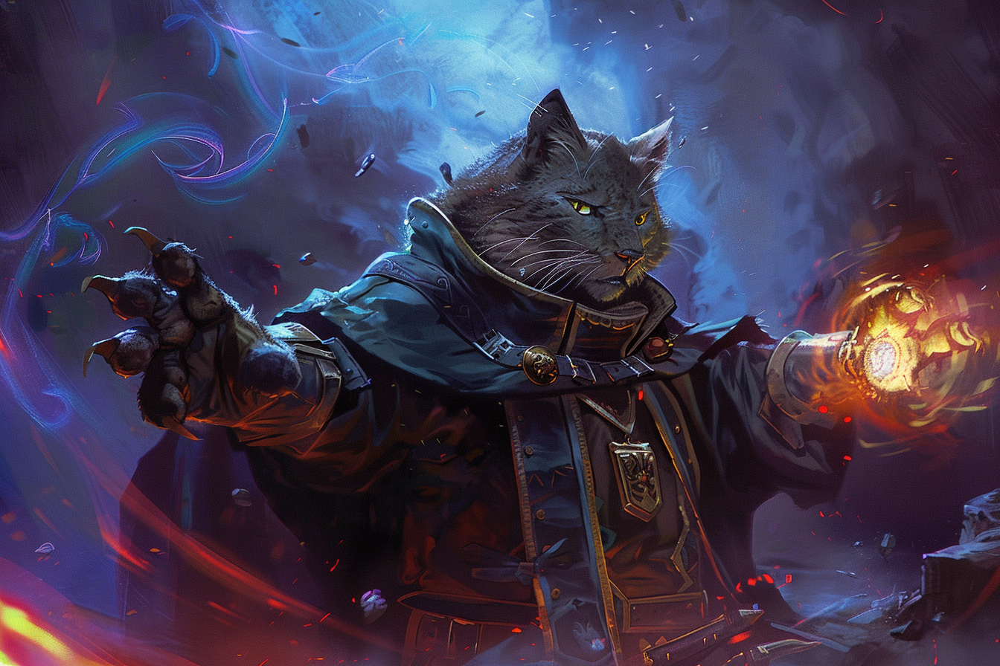

# Ayum Teeh

## Informations générales

| | | | |
|---|---|---|---|
| **Nom** | Ayum Teeh | **Niveau** | 5 |
| **Age** | 21 | **Classe** | Occultiste 3 / Ensorceleur 2 |
| **Alignement** | Chaotic Neutral  | **Expérience** | *Threshold* |
|**Taille** | 1m77 | **Race** | Tabaxi |
| |  | **Bonus de maîtrise** | +3 |

| | | | |
|---|---|---|---|
| **HP actuels** | 6 | **HP Max** | 31 |
| **HP temporaires** | 0 | | |
| **Dés de vie actuels** | 3d8 2d6 | **Dés de vie max** | 3d8 2d6 |
| **Charges Tentacules des Profondeurs** | 2 | **Charges Max. Tentacules des Profondeurs** | 3 |

| Niveau Emplacement | Actuels | Maximum | 
| - | - | -| 
| Occultiste (Level 2) | 0 | 2| 
| Level 1 | 2 | 3| 
| Sorcellerie | 2 | 2 (niv. sorc.)|

## Ability scores

| |Caractéristique|Modificateur| Jets de Sauvegarde |
|-|-|-|-|
|Force|**8**|**-1**|**-1**|
|Dextérité|**16**|**+3**|**+3**|
|Constitution|**12**|**+1**|**+1**|
|Intelligence|**13**|**+1**|**+1**|
|Sagesse|**10**|**+0**|**+2** (prof)|
|Charisme|**16**|**+3**|**+5** (prof)|

|Nom|Type|Proficiency|Bonus|
|-|-|-|-|
|Acrobaties|DEX||+3|
|Arcanes|INT|x (Warlock)|+3|
|Athlétisme|FOR||-1|
|Discrétion|DEX|x (Tabaxi)|+5|
|Dressage|SAG||+0|
|Escamotage|DEX||+3|
|Histoire|INT||+1|
|Intimidation|CHA||+3|
|Intuition/Perspicacité|SAG|x (Far Traveler)|+2|
|Investigation|INT||+1|
|Médecine|SAG||+0|
|Nature|INT||+1|
|Perception|SAG|x (Tabaxi / Far Traveler)|+2|
|Persuasion|CHA||+3|
|Religion|INT||+1|
|Représentation|CHA||+3|
|Survie|SAG||+0|
|Tromperie|CHA|x (Warlock)|+5|

## Caractéristiques de combat
| | |
|-|-|
|**Bonus d'initiative**|+3|
|**Classe d'armure**|15 = 12 (Armure de cuir clouté) + 3 (DEX)|
|**Vitesse**|9m|
|**Vitesse d'escalade**|6m|
|**Vitesse de nage**|12m|

### Attaques
|Arme|Toucher|Dégâts|Portée|Formule Toucher|Formule Dégâts|
|-|-|-|-|-|-|
|**Griffes**|1d20+2|1d4-1 tranchants||1d20+FOR+PROF|1d4+FOR|
|**Sceptre du gardien des pactes +1**|1d20+3|1d8 contondants||1d20+FOR+PROF+1|1d8+FOR+1|
|**Sceptre du gardien des pactes +1 / Shillelagh**|1d20+7|1d8+4 contondants||1d20+CHA+PROF+1|1d8+CHA+1|
|**Dague**|1d20+6|1d4+3 tranchants|20/60|1d20+DEX+PROF|1d8+DEX|
|**Arbalète Légère**|1d20+6|1d8+3 perforants|20/60|1d20+DEX+PROF|1d8+DEX|

### Sorts

*DD de sauvegarde contre les sorts* - **14** (8+prof+CHA)

*Modificateur d'attaque pour les sorts* - **+6** (prof+CHA)

#### Cantrips
|Nom - EN|Nom - FR|Level| Cheat Sheet | Autre |
|-|-| - |-| - |
|[**Eldritch Blast**](./SORTS/LEVEL0/EldritchBlast.md)|Décharge Occulte|Cantrip|1d10+3 (CHA), 2 rayons|
|[**Prestidigitation**](./SORTS/LEVEL0/Prestiditation.md)|Prestidigitation|Cantrip|3 effets, 1 heure|
|[**Thaumaturgy**](./SORTS/LEVEL0/Thaumaturgy.md)|Thaumaturgie|Cantrip|3 effets, 1 minute|
|[**Shillelagh**](./SORTS/LEVEL0/Shillelagh.md)|Crosse des druides|Cantrip|Action Bonus|
|[**Shape Water**](./SORTS/LEVEL0/ShapeWater.md)|Façonnage de l'eau|Cantrip|2 effets, 1 heure|
|[**Shocking Grasp**](./SORTS/LEVEL0/ShockingGrasp.md)|Poigne électrique|Cantrip|2d8, pas de réaction|
|[**Minor Illusion**](./SORTS/LEVEL0/MinorIllusion.md)|Illusion Mineure|Cantrip|1 action par créature pour dissiper, Jet INT|
|[**Control Flames**](./SORTS/LEVEL0/ControlFlames.md)|Contrôles des flammes|Cantrip|3 effets|
|[**Create Bonfire**](./SORTS/LEVEL0/CreateBonfire.md)|Embrasement|Cantrip|Concentration, 1mn, JdS Dex, 2d8 feu|
|[**Mind Sliver**](./SORTS/LEVEL0/MindSliver.md)|Piqûre Mentale|Cantrip|2d6, JdS INT, Désavantage prochain JdS|Psionique |

#### Leveled Spells
|Nom - EN|Nom - FR|Level| Cheat Sheet | Autre |
|-|-| - |-| - |
|[**Armor of Agathys**](./SORTS/LEVEL1/ArmorOfAgathys.md)|Armure d'Agathys|Level 1|1 heure, 10 PV, 10 dégâts|
|[**Unseen Servant**](./SORTS/LEVEL1/UnseenServant.md)|Serviteur invisible|Level 1|18m|
|[**Dissonant Whispers**](./SORTS/LEVEL1/DissonantWhispers.md)|Murmures Dissonants|Level 1||Psionique|
|[**Charm Person**](./SORTS/LEVEL1/CharmPerson.md)|Charme-Personne|Level 1||Psionique|
|[**Shield**](./SORTS/LEVEL1/Shield.md)|Bouclier|Level 1||
|[**Chromatic Orb**](./SORTS/LEVEL1/ChromaticOrb.md)|Orbe Chromatique|Level 1||
|[**Thunderwave**](./SORTS/LEVEL1/Thunderwave.md)|Vague Tonnante|Level 1||
|[**Shatter**](./SORTS/LEVEL2/Shatter.md)|Fracassement|Level 2|3d8 tonnerre, JdS Constitution|
|[**Silence**](./SORTS/LEVEL2/Silence.md)|Silence|Level 2|36m, Concentration, Rayon 6m, Immu. Tonnerre (Rituel)|

#### Rituels

|Nom - EN|Nom - FR|Level| Cheat Sheet |
|-|-| - |-|
|[**Find Familiar**](./SORTS/LEVEL1/FindFamiliar.md)|Appel de familier|Level 1|**10po**, 1 heure (Rituel uniquement)|
|[**Detect Magic**](./SORTS/LEVEL1/DetectMagic.md)|Détection de la magie|Level 1|9m (Rituel uniquement)|

### Autres
*Agilité féline* - Vos réflexes et votre agilité vous permettent de vous déplacer à toute vitesse. Lorsque vous vous déplacez à votre tour en combat, vous pouvez doubler votre vitesse jusqu'à la fin du tour. Une fois que vous avez utilisé ce trait, vous ne pouvez plus l'utiliser jusqu'à ce que vous vous déplaciez de 0 m à l'un de vos tours.

*Tentacule des profondeurs*
* Vous pouvez invoquer magiquement un tentacule spectral qui frappe vos ennemis. En tant qu'action bonus, vous créez un tentacule de 3 mètres de long à un point que vous pouvez voir dans un rayon de 12 mètres autour de vous. Le tentacule dure 1 minute ou jusqu'à ce que vous utilisiez cette caractéristique pour créer un autre tentacule.
* Lorsque vous créez le tentacule, vous pouvez effectuer une attaque de sort en mêlée contre une créature située à moins de 3 mètres de lui. Si vous touchez, la cible subit 1d8 dégâts de froid et sa vitesse est réduite de 3 m jusqu'au début de votre prochain tour. 
* Comme action bonus à votre tour, vous pouvez déplacer le tentacule jusqu'à 9 m et répéter l'attaque.
* Vous pouvez invoquer le tentacule un nombre de fois égal à votre bonus de maîtrise, et vous regagnez toutes les utilisations dépensées à la fin d'un long repos.

*Sceptre du gardien des pactes +1* (DISPONIBLE)
* Vous pouvez récupérer un emplacement de sort d'occultiste dépensé si vous tenez le sceptre en main. Coûte **une action** et une fois par **repos long**.

## Traits utilitaires
### Discours télépathique
Vous pouvez créer un lien télépathique entre votre esprit et celui d'un autre. En tant qu'**action bonus**, choisissez une créature que vous pouvez voir à **6 mètres** de vous. Vous et cette créature pouvez parler télépathiquement l'un avec l'autre tant que vous êtes à une nombre de kilomètres inférieur à votre modificateur de Charisme multiplié par 1.5.

Pour vous parler mentalement, vous devez parler une langue que l'autre personne comprenne.

Le lien télépathique dure un nombre de minutes égal à votre niveau d'ensorceleur. Il cesse prématurément si vous êtes neutralisé, si vous mourrez ou si vous utilisez cette compétence pour former un lien avec une autre créature.

### Traits raciaux
*Vision dans le noir* - Vous avez les sens aiguisés d'un chat, surtout dans l'obscurité. Vous pouvez voir dans une lumière faible à moins de 12 m de vous comme s'il s'agissait d'une lumière vive, et dans l'obscurité comme s'il s'agissait d'une lumière faible. Dans l'obscurité, vous ne discernez pas les couleurs, mais seulement les nuances de gris.

### Traits de classe
*Don de la mer* - Vous pouvez respirer sous l'eau.

### Pacte du Grimoire
Votre protecteur vous donne un grimoire appelé un **livre des ombres** : 
* Quand vous gagnez cette aptitude, vous choisissez trois sorts mineurs dans n'importe quelle liste de sorts. Tant que le livre est sur vous, vous pouvez lancer ces sorts mineurs à volonté et ils ne comptent pas dans le nombre de sorts mineurs que vous connaissez. Vous les considérez comme des sorts d'occultiste.
* Si vous perdez votre livre, vous pouvez accomplir une cérémonie d'une heure pour que votre protecteur vous donne une nouveau livre de remplacement.
* Votre livre des ombres se désagrège à votre mort.

### Sorts psioniques
A chaque fois que vous gagnez un niveau d'ensorceleur, vous pouvez remplacer un sort **psionique** par un autre sort du même niveau. Le nouveau sort doit être un sort de **divination** ou d'**enchantement** de la liste des sorts d'**ensorceleur**, **occultiste** ou **magicien**.

## Invocations Occultes

*Agonizing Blast (Décharge déchirante)* - Quand vous lancez *décharge occulte*, ajoutez votre modificateur de Charisme aux dégâts causés par le sort.

*Book of Ancient Secrets (Livre des secrets anciens)*
* Vous pouvez maintenant inscrire des rituels magiques dans votre livre des ombres. Choisissez deux sorts de niveau 1 dotés de la mention *rituel* dans n'importe quelle liste de sort. Ces sorts apparaissent dans votre livre et ne sont pas comptabilisés dans le nombre de sorts que vous connaissez. 
* Quand vous avez votre livre des ombres en main, vous pouvez lancer les sorts que vous avez choisis en tant que rituels. Vous pouvez lancer ces sorts uniquement comme des rituels.
* Vous pouvez lancer un sort d'occultiste que vous conaissez comme un rituel s'il possède la mention *rituel*.
* Lors de vos aventures, vous pouvez ajouter de nouveaux rituels dans votre livre des ombres. Quand vous trouvez un tel sort, vous pouvez l'ajouter à votre livre si le niveau du sort est inférieur ou égal à la moitié de votre niveau d'occultiste (arrondi au supérieur). Pour chaque niveau de sort, le processus de transcription prend deux heures et coûte 50 PO.

## Maîtrises

| | |
|-|-|
|**Langues parlées**|Commun, Draconique, Goblin|
|**Instruments**|Chamisen|
|**Armures**|Légère|
|**Armes**|Armes courantes|
|**Outils**|Aucun|

## Organisations 
* [**L'Ectoplasme Joyeux**](./AVENTURE/ORGANISATIONS/EctoplasmeJoyeux.md) - Co-fondateur et co-propriétaire
* [**Force Grise**](./AVENTURE/ORGANISATIONS/ForceGrise.md) - Membre