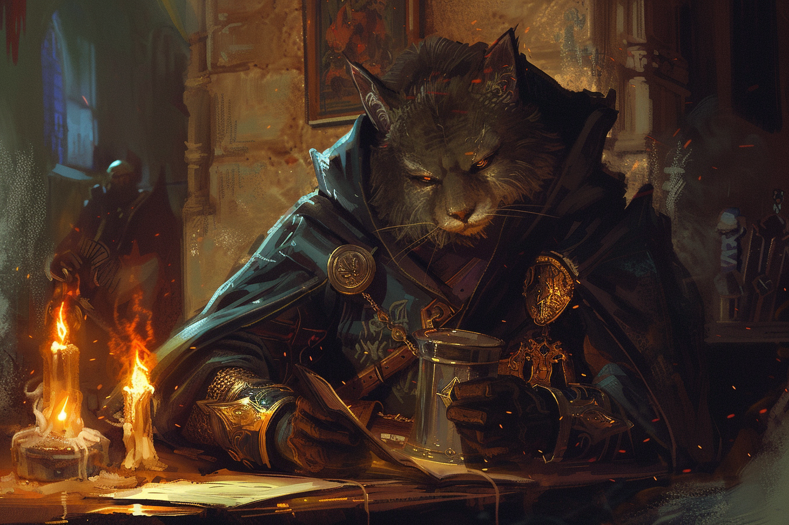
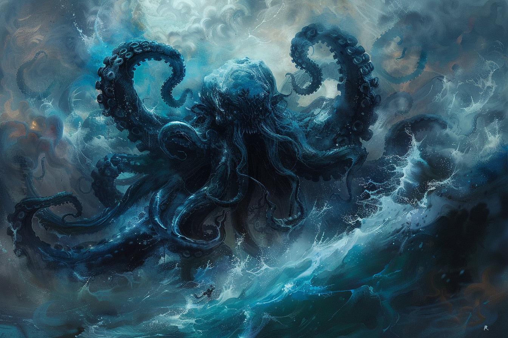

# Ayum Teeh

## Personnalité
|||
|-|-|
|**Alignement**|Chaotic Neutral|
|**MBTI**|INTP|
|**Colors**||

## Background - Far Traveler
Voir [Histoire](./HISTOIRE/_Sommaire.md).

De nature très curieuse, **Ayum** cherche toujours de la nouveauté et de la stimulation dans tout ce qu'il entreprend. Il s'est mis en voyage pour découvrir le plus possible sur le monde et ses merveilles.

En tout cas, avant de faire la connaissance avec son *protecteur*...

## Personnalité 

### J'adore : 
* Apprendre de nouvelles langues ; 
* Découvrir de nouveaux lieux;
* Découvrir de nouvelles saveurs ;
* Regarder l'océan ;
* La bague de mon grand-père ;

### Je déteste : 
* Les légumes ;
* Regarder l'eau qui n'est pas l'océan ; 
* Les gens qui ne suivent pas mon plan ; 
* Les gens qui s'approchent trop de mon espace personnel ;
* Les gens qui ne comprennent pas ou jugent mes coutumes ;

### Je suis prêt à faire du mal pour : 
* Conserver ma liberté ;

### Je le fais malgré moi : 
* Mon accent (*italien*) ; 
* Jouer avec la bague de mon grand-père ;

## Otherwordly patron - Fathomless

De son nom complet **Aiumhykl'iteeh'tha'graznolokanathraxiorvandjansthulondriekantumalakar**, ou plus simplement **Aium**, cette entité vit dans les profondeurs de la mer des Épées. 

Pas grand chose n'est connue à son sujet, puisqu'elle ne se déplace jamais près des côtes, et qu'elle reste tapie dans les profondeurs.

**Aium** ne rêve que d'une chose : pouvoir un jour en savoir assez sur la terre ferme afin de pouvoir réduire en esclavage certains de ses habitants. Il est avide de pouvoir et ne s'arrêtera devant pas grand chose.

**Ayum** et **Aium** se sont recontrés lorsque le bâteau d'**Ayum** qui devait l'amener d'**Alaron** à la **Porte de Baldur** s'est échoué. **Aium** lui alors proposé un pacte en échange de sa vie: lui servir d'yeux sur la terre ferme, et lui aider à comprendre d'avantage sur les us et coutumes des espèces vivant au-delà du rivage.

### Termes du pacte
Les termes du pacte dicté par **Aium** est très vague, ne se reposant pas sur la même rigueur bureaucratique que les démons et les fiélons.

Pire encore, tous les termes du contrat on été énoncés avant son acceptation par **Ayum**, cependant un des termes était d'accepter l'effacement de tout souvenir lié au pacte.

Les **conditions**, toutes inscrites dans la tête d'**Ayum**, lui sont dévoilés petit à petit, chaque case de sa mémoire revenant au fur et à mesure qu'**Aium** lui demande des services. 

A ce jour, **Ayum** connaît les termes suivants : 
* "Tu oublieras les termes du présent pacte."
* "Tu n'as pas le droit d'atteindre à ta vie ou à ton intégrité physique."
* "Tu devras te référer à moi comme si c'était toi même."
* "Tu devras changer tes nom et prénom pour en choisir de nouveaux qui soit contenus dans le mien ; et tu devras oublier ton ancien nom."

* "Tu porteras cette marque sur ton bras."
* "Tu devras chercheras à collecter le sang du plus d'espèces intelligentes possibles et à les goûter".
* "Tu te montreras le plus curieux possible sur les jeux de pouvoir politiques de la terre ferme et sur le moyen de les déstabiliser."

### Particularités

**Aium** possède les particularités suivantes qui en font un protecteur pour le moins étrange : 
* Il n'apparaît à **Ayum** qu'en vision ou en s'exprimant à travers son corps ; 
* Son regard apparaît parfois dans toute eau douce ou salée, afin de surveiller **Ayum**.

