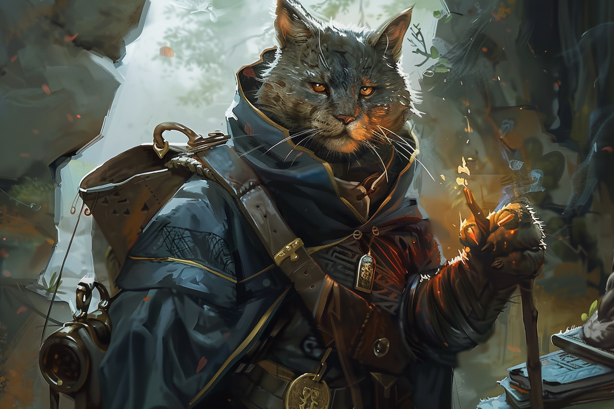

# Inventaire & Equipement

## Equipé
|||
|-|-|
|**Corps**|Armure de cuir|
|**Main droite**|Armre d'hast|
|**Main gauche**|Arme d'hast|
|**Ceinture**|2 Dagues, Arbalète légère (20 carreaux)|
|**Dos**|Sac à dos|
|**Instrument**|Chamisen|

## Inventaire

### Equipement
* Vêtements de voyageur

### Armes
-

### Objets
* Carte peu précise de Faerûn
* Anneau gravé, légué par son grand-père
* Bourse
* Arcane focus
* Livre d'histoire
* Plume et encre
* 10 parchemins
* Petit sac de sable
* Petit couteau
* Papier attestant de l'arrivée à Eauprofonde (durée 10 jours ; restants 10 jours)
* Cahier où il écrit ses aventures
* Pipe avec tête de Tabaxi dessus qui sourit
* Pour une semaine de tabac

## Argent
| | |
|-|-|
|**Platine**|0|
|**Or**|14|
|**Argent**|7|
|**Cuivre**|0|