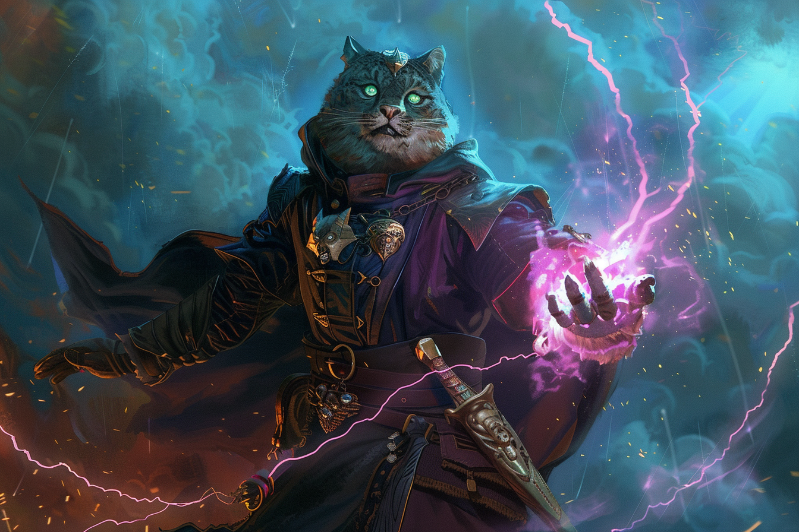

# Leveling up - To be unlocked 

## Level 3

## Spellcasting
* +1 spell
* Spell solts : Level 1 -> Level 2

### Pact Boon
At 3rd level, your otherworldly patron bestows a gift upon you for your loyal service.

*Pact of the Tome*
* Your patron gives you a grimoire called a Book of Shadows. When you gain this feature, choose three cantrips from any class's spell list (the three needn't be from the same list). While the book is on your person, you can cast those cantrips at will. They don't count against your number of cantrips known. If they don't appear on the warlock spell list, they are nonetheless warlock spells for you.
* If you lose your Book of Shadows, you can perform a 1-hour ceremony to receive a replacement from your patron. This ceremony can be performed during a short or long rest, and it destroys the previous book. The book turns to ash when you die.

## Level 4

### Spellcasting
* +1 spell
### ASI or Feature
### Eldritch Versatility (optional)

## Level 5
### Spellcasting
* +1 spell
* Level 2 -> Level 3

### +1 Eldritch Invocation
### Proficiency bonus : +2 -> +3

## Level 6

### Spellcasting
* +1 spell
### Otherworldly patron
*Oceanic Soul* - At 6th level, you are now even more at home in the depths. You gain resistance to cold damage. In addition, when you are fully submerged, any creature that is also fully submerged can understand your speech, and you can understand theirs.

*Guardian Coil* - At 6th level, your Tentacle of the Deeps can defend you and others, interposing itself between them and harm. When you or a creature you can see takes damage while within 10 feet of the tentacle, you can use your reaction to choose one of those creatures and reduce the damage to that creature by 1d8. When you reach 10th level in this class, the damage reduced by the tentacle increases to 2d8.

## Level 7
### Spellcasting
* +1 Spell
* Level 3 -> Level 4

### +1 Eldritch Invocation

## Level 8
### Spellcasting
* +1 spell

### ASI or Feature
### Eldritch Versatility (optional)

---
---
---

## Level 10
*Tentacle of the Deep* - When you reach 10th level in this class, the damage increases to 2d8.

*Grasping Tentacles* - Starting at 10th level, you learn the spell Evard's Black Tentacles. It counts as a warlock spell for you, but it doesn't count against the number of spells you know. You can also cast it once without using a spell slot, and you regain the ability to do so when you finish a long rest.

Whenever you cast this spell, your patron's magic bolsters you, granting you a number of temporary hit points equal to your warlock level. Moreover, damage can't break your concentration on this spell.

## Level 14 
*Fathomless Plunge* - When you reach 14th level, you can magically open temporary conduits to watery destinations. As an action, you can teleport yourself and up to five other willing creatures that you can see within 30 feet of you. Amid a whirl of tentacles, you all vanish and then reappear up to 1 mile away in a body of water you've seen (pond size or larger) or within 30 feet of it, each of you appearing in an unoccupied space within 30 feet of the others.

Once you use this feature, you can't use it again until you finish a short or long rest.