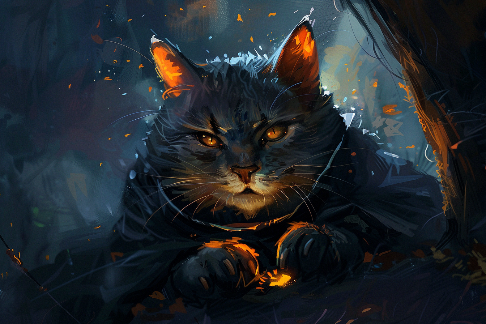

# Kuubi - L'Enfant

Alter enfantin, il a peur de tout ce qui l'entoure.

Il est l'alter qui **écarte les autres du danger** en leur évitant de participer à des activité trop dangereuses. Lorsqu'il sent qu'il a un peu moins peur, il peut se montrer très joueur, comme un chaton, mais ne reste jamais très longtemps dans cette situation car cela est souvent le signe que son travail est accompli.

| | |
| - | - |
| **Trigger d'apparition** | Quand il se sent en danger |
| **Trigger de disparition** | Lorsqu'il est dans un endroit qui lui inspire la confiance et la sécurité |
| **Cherche** | Le calme et la sécurité |
| **Déteste** | Qu'on le presse |
| **Âge** | 7 |
| **Espèce** | 25% humain, 25% elfe, 50% goblours |
| **MBTI** | INFP |
| **Accent** | Parle avec une toute petite voix |
