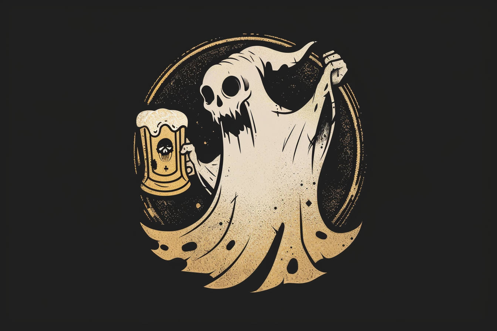

# L'Ectoplasme Joyeux - Taverne

Cette taverne a été crée par nous, et se situe dans les locaux du **manoir de Troll-Crâne**.

La taverne est tenue par nous-même, ainsi que par [**Asif**](#asif---tavernier), qui hante les lieux.

La taverne est détenue à 1/3 par [Renaer Pas-de-braises](../PERSONNAGES/Renaer-Pas-de-Braises.md), et à 2/3 par moi-même, [Finn](../PERSONNAGES/Finn.md) et [Seemon](../PERSONNAGES/Seemon.md).

## Descrption
La taverne se situe dans un ancien manoir, le **manoir de Troll-Crâne**.

Elle s'étend sur une hauteur de trois étages. A l'étage, se situe les chambres et les bureaux des propriétaires.

## Membres

### Asif - Tavernier fantôme
Fantôme qui était présent lors de l'acquisition du **manoir**, **Asif** hante les lieux et a bien voulu assister à la tenue de la taverne.

### [Renaer Pas-de-braises](../PERSONNAGES/Renaer-Pas-de-Braises.md)
Renaer, noble de la ville, est détenteur à 1/3 de la taverne, après qu'il ait payé les rénovations.