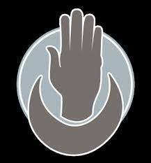

# La Force Grise

La **Force Grise** est une organisation gérée par le [**Sceptre Noir**](../PERSONNAGES/VajraSafahr.md) et agit comme le complémentaire de la police d'**Eauprofonde** : elle intervient dès qu'il s'agit de résoudre des problèmes plus graves, plus étranges, plus dangereux ou plus ésotériques. 

Les membres de la Force Grise sont appelés les **Mains Grises**, et sont considérés comme étant d'astreinte à tout instant.

Les membres de la **Force Grise** sont autorisés à refuser les missions qu'ils se voient confier, cependant un trop gros nombre de refus les voue à une exclusion directe.

## Membres 

### Les Aventuriers
Nous faisons tous partie de cette organisation.