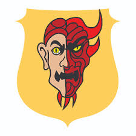

# Les Gralhunds

Seigneurs locaux de la ville d'**Eauprofonde**, ils sont de mèches avec les [**Zentharims**](./Zentharims.md).

## Implication avec les Zentharims
Ils auraient été menacés par les **Zentharims** de telle sorte que ces derniers puissent utiliser leur manoir comme base d'opérations.

## Nécromancie
Leur jardinier est probablement un zombie.

## Membres

### Yalah Gralhund
La femme du couple. C'est la cheffe de la famille. 

Elle ne semble pas accorder grande importance à son mari.

> Nous sommes en mauvais terme avec elle.

### Orond Gralhund
Le mari du couple. N'est clairemznt pas autant intéressé que sa femme par les luttes de pouvoir.

### Les enfants
Les seigneurs **Gralhunds** ont des enfants.