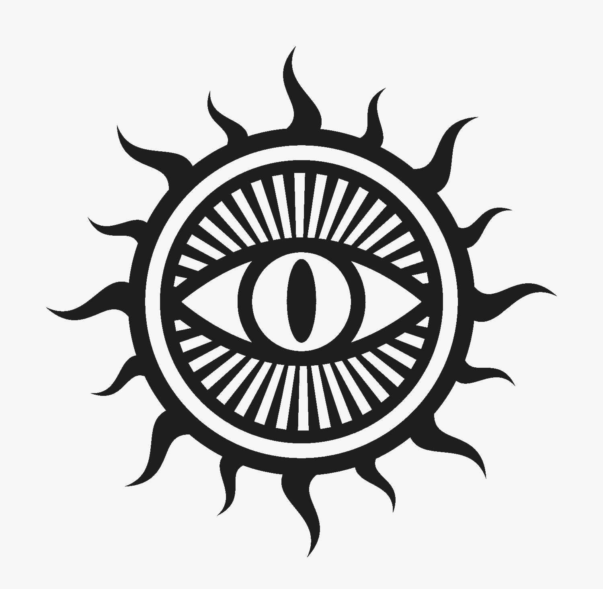

# La Guilde de Xanathar

Guilde de criminels de la ville d'Eauprofonde, en grande rivalité/tension avec les [**Zentharims**](./Zentharims.md).

Tous les membres portent le même symbole (un cercle contenant un oeil), ou se le font tatouer.

## Membres

### Xanathar
Chef absolu de la guilde. Les personnes ne savent pas grand chose d'autre que son prénom à propos de lui.

### Xorg
Un de chefs.