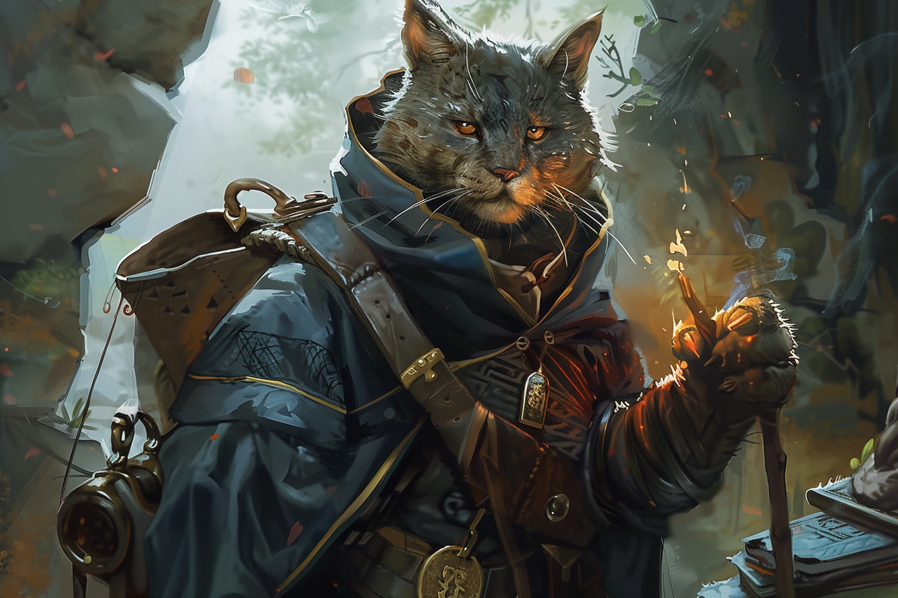

# Inventaire & Equipement

## Equipé
|||
|-|-|
|**Corps**|Robe de puissance|
|**Main droite**|Sceptre du gardien des pactes +2|
|**Main gauche**|Sceptre du gardien des pactes +2|
|**Amulette**| Amulette de bonne santé |
|**Doigt 1**| Anneau des profondeurs |
|**Doigt 2**|  |
|**Ceinture**| Bloodwell Vial +2 |
|**Dos**|Sac à dos|
|**Instrument**|Chamisen|

### Sceptre du gardien des pactes
* Arme d'hast +1 (1d8+0)
* Tant que vous tenez ce sceptre en main, vous obtenez un bonus aux jets d'attaque des sorts et aux DD des jets de sauvegard effectués contre vos sorts d'occultiste (+1).
* De plus, vous pouvez récupérer un emplacement de sort d'occultiste dépensé si vous tenez le sceptre en main. Cette propriété vous coûte une action et vous ne vous pas la réutiliser avant la fin de votre prochain **repos long**.

## Inventaire

### Equipement
* Vêtements de voyageur
* Vêtements de Xanatharien
* Armure de cuir clouté
* Anneau de protection
* Bottes ailés

### Armes
* Arme d'hast
* Arc court gobelin

### Objets
*Utilitaires*
* Carte peu précise de Faerûn
* Arcane focus
* Plume et encre
* 10 parchemins
* Bourse
* Livre d'histoire
* Petit sac de sable
* Petit couteau
* Potion de respiration aquatique
* Un diamant valant 50 po (pour Orbe Chromatique)
* Une outre d'eau

*Consommables*
* 1 Potions de soin Greater (4d4+4)
* 1 potion de résistance de nécrotique 
* 4 Pièce spirituelle (+3 dans le coffre de la bagnole)

*Quêtes*
* Papier attestant de l'arrivée à Eauprofonde (durée 10 jours ; expiré)
* Carte d'accréditation de la [**Main Grise**](./AVENTURE/ORGANISATIONS/ForceGrise.md)
* Clé de servante de la maison des Gralhund

*Stylés*
* Anneau gravé, légué par son grand-père
* Cahier où il écrit ses aventures
* Guide des Monstres de Volo, signé
* Titre de propriété du manoir Troll-Crâne, *déchiré*
* Imperméable avec le logo de la taverne de l'Ectoplasme Joyeux, brodé
* Un chapeau stylé pour Abitbol
* Des bottes à éperons pour Abitbol

*Marrants*
* Pipe avec tête de Tabaxi dessus qui sourit
* Pour une semaine de tabac
* Livre du language des signes de Nim

## Argent
| | |
|-|-|
|**Platine**|0|
|**Or**|10971|
|**Argent**|2|
|**Cuivre**|0|

## Pot commun
| | |
|-|-|
|**Platine**|0|
|**Or**|21|
|**Argent**|0|
|**Cuivre**|0|