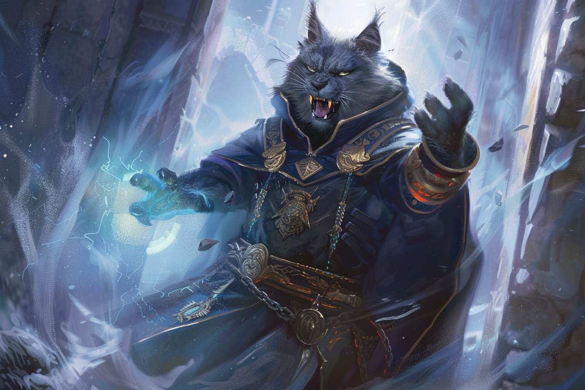

# Vandjans - Le Colérique

Alter colérique, il ne recule devant rien pour obtenir ce qui lui semble lui revenir de droit.

Il est l'alter qui **protège les autres des menaces imminentes** en réduisant la menace à néant. Il est également extrêmement **rancunier**, et cherche à se venger s'il s'estime lésé.

C'est un guerrier et génie du combat tactique.

| | |
| - | - |
| **Trigger d'apparition** | Quand il est frustré, en danger imminent, ou en situation de stress |
| **Trigger de disparition** | Lorsque la situation de stress disparaît |
| **Cherche** | La vengeance, à tout prix |
| **Déteste** | Qu'on ne le respecte pas |
| **Âge** | 43 |
| **Espèce** | Demi-Orc |
| **MBTI** | ESTJ |
| **Accent** | Voix rauque |