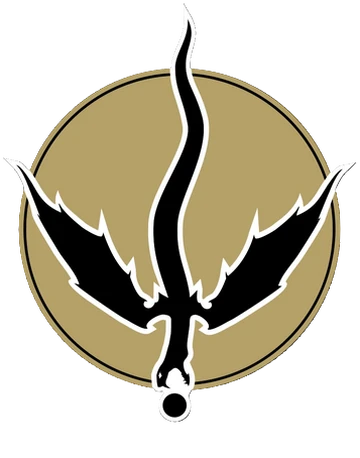
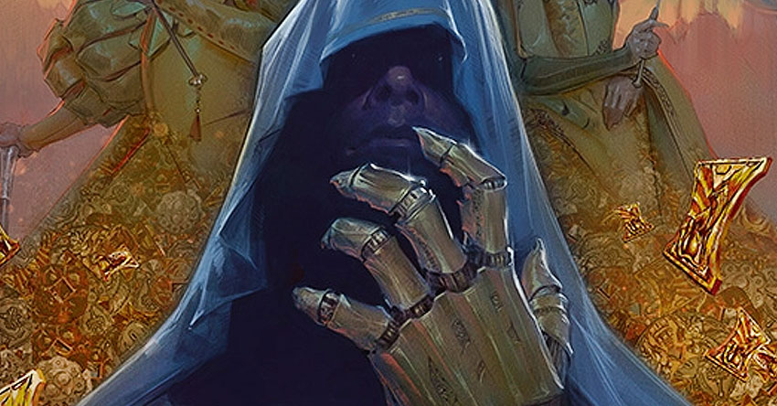
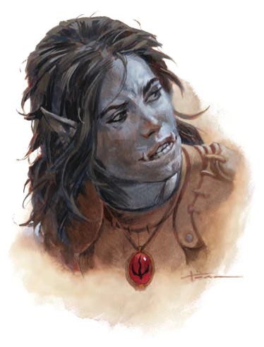
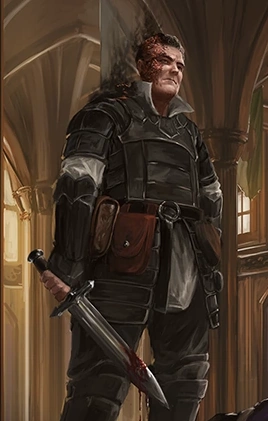

# Zentharim

Guilde d'Eauprofonde, en grande rivalité/tension avec [**la Guilde de Xanathar**](./GuildeDeXanathar.md).

Plusieurs membres peuvent traîner au [**Dragon Embrôché**](../Lieux.md#dragons-embrôché---taverne).

On dit que l'organisation est perturbée par les luttes intestines pour la prise de pouvoir.

## Membres

### Manshoon - Maître de la guilde

Célèvre archimage obsédé par la mort, il s'est cloné afin de devenir immortel, cependant certains de ses clones se sont entretués. 

Quelques uns de ses clones craignent pour leur vie. 

Ce **Manshoon** serait à la tête des **Zentharims**.

### Yagra 

* Demi-orque
* Traîne au [**Portail Soupirant**](../ORGANISATIONS/AubergeDuPortailSoupirant.md)
* Nous avons rencontré **Yagra** au **Portail Soupirant** alors qu'elle était en train de s'énerver sur des membres de la [**Guilde de Xanathar**](./GuildeDeXanathar.md).

### Urstul Floxin

Un des chefs des Zentharims.

### Le Croc Doré
Ancien groupe d'aventuriers, ce groupuscule des **Zentharims** s'occuperait de la gestion des actifs, des négociations et de la gestion des forces de l'organisation.