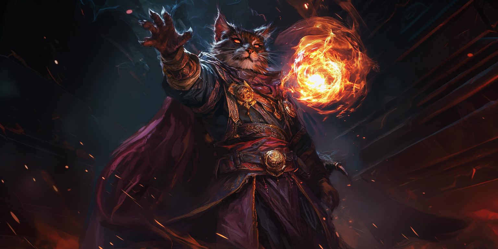

# Hellish Rebuke - Représailles Infernales

|Ecole|Niveau|Temps d'incantation|Portée|Composantes|Durée|
|-|-|-|-|-|-|
|Evocation|Niveau 1|1 Réaction (vous subissez des dégâts)|18 m|V, S|Instantanée|

The creature that damaged you is momentarily surrounded by green flames.

It makes a Dexterity saving throw, taking 2d10 Fire damage on a failed save or half as much damage on a successful one.

**Using a Higher-Level Spell Slot** - The damage increases by 1d10 for each spell slot level above 1.