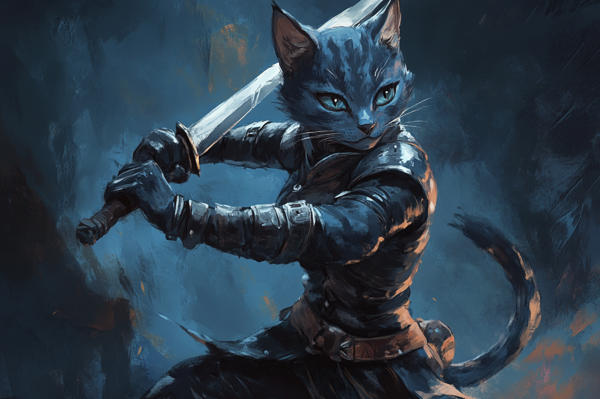

# Fennec Noire



## Informations générales

| | | | |
|---|---|---|---|
| **Nom** | Fennec Noir | **Niveau** | 1 |
| **Age** | 25 | **Classe** | Guerrier 1 |
| **Alignement** | Lawful Neutral  | **Expérience** | *Threshold* |
|**Taille** | 1m73 | **Race** | Tabaxi |
| |  | **Bonus de maîtrise** | +2 |

| | | | |
|---|---|---|---|
| **HP actuels** | 12 | **HP Max** | 12 |
| **HP temporaires** | 0 | | |
| **Dés de vie actuels** | 1d10 | **Dés de vie max** | 1d10 |
| **Second Souffle actuels** | 2 | **Second Souffle max** | 2 |

| Niveau Emplacement | Actuels | Maximum | 
| - | - | -| 


## Ability scores

| |Caractéristique|Modificateur| Jets de Sauvegarde |
|-|-|-|-|
|Force|**17**|**+3**|**+5 (prof)**|
|Dextérité|**14**|**+2**|**+2**|
|Constitution|**14**|**+2**|**+4 (prof)**|
|Intelligence|**8**|**-1**|**-1**|
|Sagesse|**13**|**+1**|**+1**|
|Charisme|**8**|**+0**|**+0**|


|Nom|Type|Proficiency|Bonus|
|-|-|-|-|
|Acrobaties|DEX|x (Tabaxi)|+4|
|Arcanes|INT||-1|
|Athlétisme|FOR|x (Guerrier)|+5|
|Discrétion|DEX|x (Tabaxi)|+4|
|Dressage|SAG||+1|
|Escamotage|DEX||+2|
|Histoire|INT||-1|
|Intimidation|CHA||-1|
|Intuition/Perspicacité|SAG|x (Garde)|+3|
|Investigation|INT||-1|
|Médecine|SAG||+1|
|Nature|INT||-1|
|Perception|SAG|x (Garde)|+3|
|Persuasion|CHA||-1|
|Religion|INT||-1|
|Représentation|CHA||-1|
|Survie|SAG|x (Garde)|+3|
|Tromperie|CHA||-1|

## Caractéristiques de combat
| | |
|-|-|
|**Bonus d'initiative**|+4 = DEX + Prof (Alerte)|
|**Classe d'armure**|15 = 13 + DEX|
|**Vitesse**| 9 m / 30 ft.|

### Attaques
|Arme|Toucher|Dégâts|Portée|Maîtrise|Formule Toucher|Formule Dégâts|
|-|-|-|-|-|-|-|
|**Griffes**|+5|1d4+3|5 ft.|Grapple / Shove|1d20+FOR+PROF|1d4+FOR|
|**Epée longue**|+5|2d6+3|5 ft.|Graze|1d20+FOR+PROF|1d4+FOR|
|**Arc long**|+4|1d8+2|150 / 600 ft.|Slow|1d20+DEX+PROF|1d8+DEX|

*Graze* - Si votre attaque **rate**, vous pouvez infliger **3 (= FOR)**. Les dégâts sont du mùême type.

*Slow* - Si votre attaque **touche** et **inflige** des dégâts, vous pouvez réduire la vitesse de la cible de **1.5 m / 3 ft.** (Non cumulable).

*Grapple* - La cible doit effectuer un **JdS de FOR/DEX** (votre choix) sous peine d'être **Grappled**. **DC** = 13 ( = 8+PROF+FOR)

*Shove* - La cible doit effectuer un **JdS de FOR/DEX** (votre choix) sous peine d'être **Prone** ou **repoussée de 5 ft.**. **DC** = 13 ( = 8+PROF+FOR)

```
Rappels : 
* Grappled : Vitesse = 0 ft., jusqu'à ce qu'un effet fasse cesser la condition (e.g. Thunderwave) ;
* Prone : Désavantagé sur les jets d'attaque, avantage pour attaquer la cible à moins de 5 ft., désavantage sinon.
```

### Traits de classe
*Style de combat* - Combat d'armes à deux mains
* Lors que vous infligez des dégâts avec une arme à deux mains, traitez tous les dés de dégâts dont le résultat est **1 ou 2 comme des 3**.

*Second Souffle* - **Action Bonus**
* Vous puisez dans une réserve limité d'endurance physique et mentale. Vous regagnez **1d10+1** (1d10 + GUERRIER) points de vie.
* Vous regagnez une charge par court repos.

### Autres
*Agilité féline* - Vos réflexes et votre agilité vous permettent de vous déplacer à toute vitesse. Lorsque vous vous déplacez à votre tour en combat, vous pouvez doubler votre vitesse jusqu'à la fin du tour. Une fois que vous avez utilisé ce trait, vous ne pouvez plus l'utiliser jusqu'à ce que vous vous déplaciez de 0 m à l'un de vos tours.

## Traits utilitaires
### Feats
*Initiative Swap* - Après avoir lancé l'initiative, vous pouvez changer votre initiative avec celle d'un allié consentant.

### Traits raciaux
*Vision dans le noir* - Vous avez les sens aiguisés d'un chat, surtout dans l'obscurité. Vous pouvez voir dans une lumière faible à moins de 20 m / 60.ft de vous comme s'il s'agissait d'une lumière vive, et dans l'obscurité comme s'il s'agissait d'une lumière faible. Dans l'obscurité, vous ne discernez pas les couleurs, mais seulement les nuances de gris.

### Traits de classe
*Maîtrises* - Greatsword, Greataxe, Longbow

## Maîtrises

| | |
|-|-|
|**Langues parlées**|Commun, Tabaxi|
|**Instruments**||
|**Armures**|Légères, Moyennes, Lourdes, Boucliers|
|**Armes**|Armes de guerre, Armes simples|
|**Outils**|Jeu de Cartes|

## Organisations 