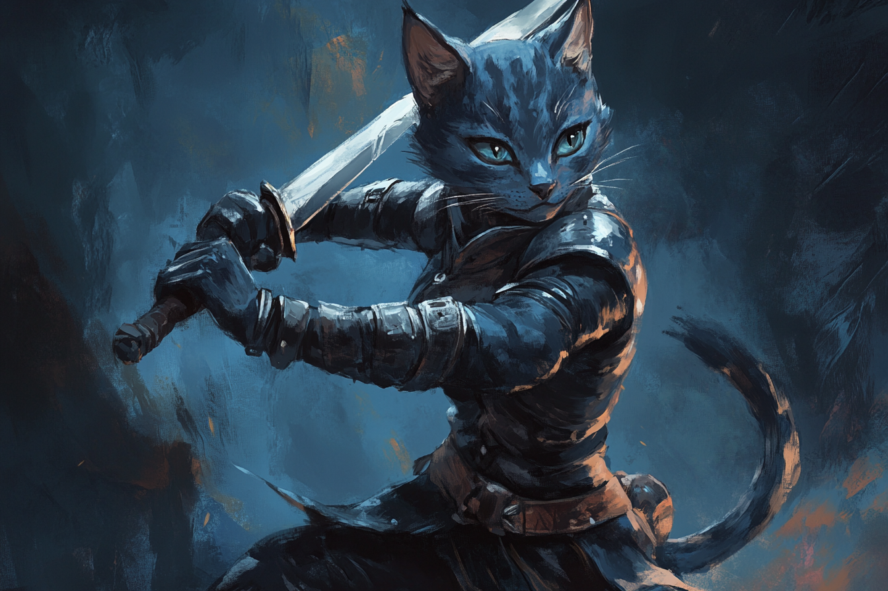

# Noire Fennec



## Informations générales

| | | | |
|---|---|---|---|
| **Nom** | Fennec Noir | **Niveau** | 7 |
| **Age** | 25 | **Classe** | Guerrier 6 / Rôdeur 1- Maître de Guerre |
| **Alignement** | Lawful Neutral  | **Expérience** | *Threshold* |
|**Taille** | 1m73 | **Race** | Tabaxi |
| **Inspiration** | x | **Bonus de maîtrise** | +3 |

| | | | |
|---|---|---|---|
| **HP actuels** | 44 | **HP Max** | 60 |
| **HP temporaires** | 0 | | |
| **Dés de vie actuels** | 7d10 | **Dés de vie max** | 7d10 |
| **Second Souffle actuels** | 3 | **Second Souffle max** | 3 |
| **Action Surge** | 0 | **Action Surge Max** | 1 |
| **Dés de Supériorité** | 0 | **Dés de Supériorité Max** | 4 | 
| **Charge de Marque du Chasseur** | 1 | **Charge de Marque du Chasseur Max** | 2 | 
| **Charges de Bottes Ailées** | 3 | **Charge de Bottes Ailées** | 4 | 

| Niveau Emplacement | Actuels | Maximum | 
| - | - | - | 
| 1 | 2 | 2 | 


## Ability scores

| |Caractéristique|Modificateur| Jets de Sauvegarde |
|-|-|-|-|
|Force|**19**|**+4**|**+7 (prof)**|
|Dextérité|**14**|**+2**|**+2**|
|Constitution|**14**|**+2**|**+5 (prof)**|
|Intelligence|**8**|**-1**|**-1**|
|Sagesse|**13**|**+1**|**+1**|
|Charisme|**8**|**-1**|**-1**|


|Nom|Type|Proficiency|Expertise|Bonus|
|-|-|-|-|-|
|Acrobaties|DEX|x (Tabaxi)||+5|
|Arcanes|INT|||-1|
|Athlétisme|FOR|x (Guerrier)||+7|
|Discrétion|DEX|x (Tabaxi)|x (Skill Expert)|+8|
|Dressage|SAG|x (Ranger)||+4|
|Escamotage|DEX|x (Skill Expert)||+5|
|Histoire|INT|||-1|
|Intimidation|CHA|||-1|
|Intuition/Perspicacité|SAG|x (Garde)||+4|
|Investigation|INT|||-1|
|Médecine|SAG|x (Garde)||+4|
|Nature|INT|||-1|
|Perception|SAG|x (Garde)||+4|
|Persuasion|CHA|||-1|
|Religion|INT|||-1|
|Représentation|CHA|||-1|
|Survie|SAG|X (Sous-classe)||+4|
|Tromperie|CHA|||-1|

## Caractéristiques de combat
| | |
|-|-|
|**Bonus d'initiative**|+5 = DEX + Prof (Alerte)|
|**Classe d'armure**|15 = 13 + DEX|
|**Vitesse**| 9 m / 30 ft.|

### Attaques
|Arme|Toucher|Dégâts|Portée|Maîtrise|Formule Toucher|Formule Dégâts|
|-|-|-|-|-|-|-|
|**Griffes**|+7|1d4+4|5 ft.|Grapple / Shove|1d20+FOR+PROF|1d4+FOR|
|**Epée longue**|+7|2d6+7|5 ft.|Graze|1d20+FOR+PROF|1d4+FOR+PROF|
|**Arc long**|+5|1d8+2|150 / 600 ft.|Slow|1d20+DEX+PROF|1d8+DEX|

*Graze* - Si votre attaque **rate**, vous pouvez infliger **4 (= FOR)**. Les dégâts sont du mùême type.

*Slow* - Si votre attaque **touche** et **inflige** des dégâts, vous pouvez réduire la vitesse de la cible de **1.5 m / 5 ft.** (Non cumulable).

*Grapple* - La cible doit effectuer un **JdS de FOR/DEX** (votre choix) sous peine d'être **Grappled**. **DC** = 13 ( = 8+PROF+FOR)

*Shove* - La cible doit effectuer un **JdS de FOR/DEX** (votre choix) sous peine d'être **Prone** ou **repoussée de 5 ft.**. **DC** = 13 ( = 8+PROF+FOR)

```
Rappels : 
* Grappled : Vitesse = 0 ft., jusqu'à ce qu'un effet fasse cesser la condition (e.g. Thunderwave) ;
* Prone : Désavantagé sur les jets d'attaque, avantage pour attaquer la cible à moins de 5 ft., désavantage sinon.
```

### Sorts

#### Level 1
|Nom - EN|Nom - FR|Level| Cheat Sheet | Origine |
|-|-| - |-| - |
|[**Hunter's Mark**](./SORTS/LEVEL1/HuntersMark.md)|Marque du Chasseur| Level 1 | | Rôdeur |
|[**Jump**](./SORTS/LEVEL1/Jump.md)|Saut| Level 1 | | Rôdeur |
|[**Zephyr Strike**](./SORTS/LEVEL1/ZephyrStrike.md)|Frappe du Zéphyr| Level 1 | | Rôdeur |

### Traits de classe
*Style de combat* - Combat d'armes à deux mains
* Lors que vous infligez des dégâts avec une arme à deux mains, traitez tous les dés de dégâts dont le résultat est **1 ou 2 comme des 3**.

*Second Souffle* - **Action Bonus**
* Vous puisez dans une réserve limité d'endurance physique et mentale. Vous regagnez **1d10+1** (1d10 + GUERRIER) points de vie.
* Vous regagnez une charge par court repos.

*Hew*
* Immediately after you score a Critical Hit with a Melee weapon or reduce a creature to 0 Hit Points with one, you can make one attack with the same weapon as a Bonus Action.

*Great Weapon Master*
* When you hit a creature with a weapon that has the Heavy property as part of the Attack action on your turn, you can cause the weapon to deal extra damage to the target. The extra damage equals your Proficiency Bonus.

#### Manoeuvres - DD 15 (8+FOR+PROF) - D8

*Ambush*

> When you make a Dexterity (Stealth) check or an Initiative roll, you can expend one Superiority Die and add the die to the roll, unless you have the Incapacitated condition.

*Trip Attack*

> When you hit a creature with an attack roll using a weapon or an Unarmed Strike, you can expend one Superiority Die and add the die to the attack’s damage roll. If the target is Large or smaller, it must succeed on a Strength saving throw or have the Prone condition.

*Pushing Attack*

> When you hit a creature with an attack roll using a weapon or an Unarmed Strike, you can expend one Superiority Die to attempt to drive the target back. Add the Superiority Die to the attack’s damage roll. If the target is Large or smaller, it must succeed on a Strength saving throw or be pushed up to 15 feet directly away from you.

### Autres
*Agilité féline* - Vos réflexes et votre agilité vous permettent de vous déplacer à toute vitesse. Lorsque vous vous déplacez à votre tour en combat, vous pouvez doubler votre vitesse jusqu'à la fin du tour. Une fois que vous avez utilisé ce trait, vous ne pouvez plus l'utiliser jusqu'à ce que vous vous déplaciez de 0 m à l'un de vos tours.

## Traits utilitaires
### Feats
*Initiative Swap* - Après avoir lancé l'initiative, vous pouvez changer votre initiative avec celle d'un allié consentant.

### Traits raciaux
*Vision dans le noir* - Vous avez les sens aiguisés d'un chat, surtout dans l'obscurité. Vous pouvez voir dans une lumière faible à moins de 20 m / 60.ft de vous comme s'il s'agissait d'une lumière vive, et dans l'obscurité comme s'il s'agissait d'une lumière faible. Dans l'obscurité, vous ne discernez pas les couleurs, mais seulement les nuances de gris.

### Traits de classe
*Maîtrises* - Greatsword, Greataxe, Longbow, Heavy Crossbow, Halbarde

*Tactical Mind* - Vous avez un esprit tactique sur et en dehors du champ de bataille. Quand vous ratez un jet de compétence, vous pouvez utiliser une charge de votre **Second Souffle** pour vous pousser vers le succès. Plutôt que de gagner des points de vie, vous pouvez ajouter **1d10** au résultat. Si cela reste un échec, votre charge n'est pas utilisée.

## Maîtrises

| | |
|-|-|
|**Langues parlées**|Commun, Tabaxi|
|**Instruments**||
|**Armures**|Légères, Moyennes, Lourdes, Boucliers|
|**Armes**|Armes de guerre, Armes simples|
|**Outils**|Jeu de Cartes, Outils de Cartographes|

## Organisations 