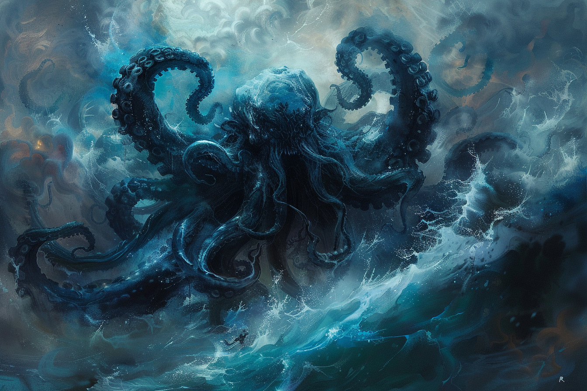

# Rencontre avec Aiumhykl'iteeh'tha

Le jour de ses 19 ans, il y a de cela 2 ans, **Ayum** avait réussi à rassembler assez d'argent avec sa famille afin de pouvoir s'acheter une place sur un bâteau de commerce afin d'aller sur le continent. 

Manque de chance, lors de la première nuit, une tempête fit rage et le bâteau tanguait violemment, si bien qu'**Ayum**, devant aider sur le pont, fut propulsé par dessus bord et tomba à la mer.

Il n'eut que le temps de contempler l'obscurité de la nuit et de ressentir la froideur de l'eau que de brefs instants avant que son âme ne commence à quitter son corps. C'est alors qu'il fit la rencontre en vision de son protecteur : 

**Aiumhykl'iteeh'tha'graznolokanathraxiorvethulondriekantumalakar**

(qui se fait souvent appeler **Aium** ou **Aiumhykl'teeh'tha** par simplicité). 

Les termes du contrat était simple : la vie d'**Ayum** contre la promesse de respecter tous les termes d'un pacte dont il n'a pas le droit de se souvenir. 

Depuis lors, **Aium**, qui cherche à en apprendre le plus possible sur la terre ferme, prend un malin plaisir à rappeler de temps en temps les termes du pacte qu'il a passé avec son serviteur. Pour l'instant, il ne lui a révélé que ceux-ci : 

* "Tu oublieras les termes du présent pacte."
* "Tu n'as pas le droit d'atteindre à ta vie ou à ton intégrité physique."
* "Tu devras te référer à moi comme si c'était toi même."
* "Tu devras changer tes nom et prénom pour en choisir de nouveaux qui soit contenus dans le mien ; et tu devras oublier ton ancien nom."
* "Tu porteras cette marque sur ton bras."
* "Tu devras chercheras à collecter le sang du plus d'espèces intelligentes possibles et à les goûter".
    * Gnome des profondeurs ;
    * Kenku ;
    * Humain ;

* "Tu te montreras le plus curieux possible sur les jeux de pouvoir politiques de la terre ferme et sur le moyen de les déstabiliser."

Coup de chance pour **Ayum** : sa volonté de découvrir le monde au-delà de la mer va de pair avec la volonté de son protecteur à découvrir la terre ferme. En espérant que cela dure...