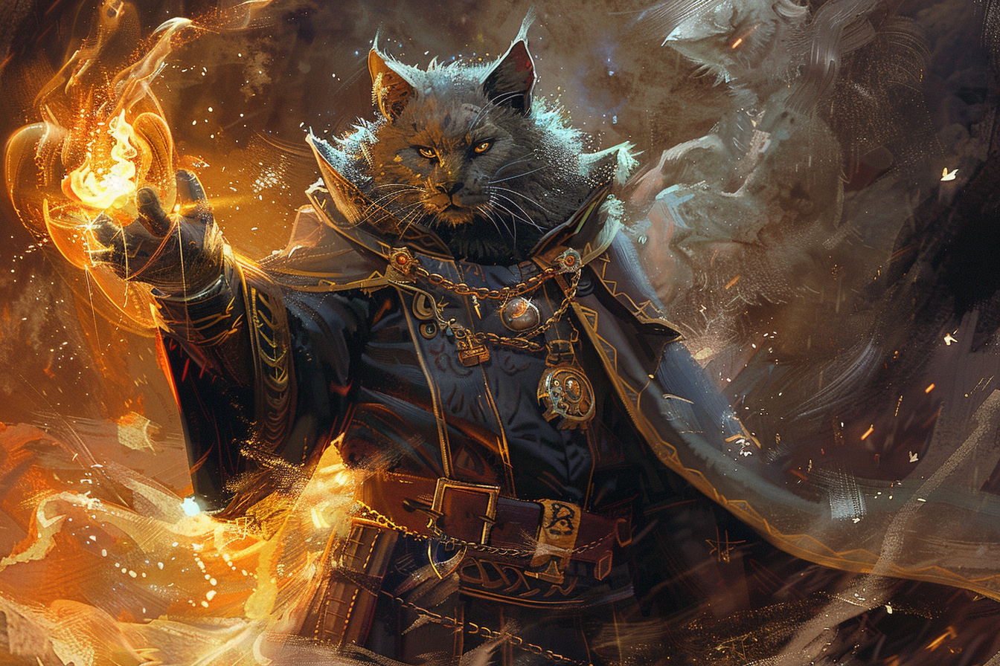

# Control Flames - Contrôle des flammes

|Ecole|Niveau|Temps d'incantation|Portée|Composantes|Durée|
|-|-|-|-|-|-|
|Transmutation|Sort mineur|1 Action|18 m|S|Instantanée ou 1 h|

Vous choisissez un feu **non magique** visible dans la portée du sort de 1,50 mètre d'arête maximum. Vous pouvez l'affecter de l'une des façons suivantes :
* Vous pouvez faire **grossir** instantanément le feu de 1,50 mètre dans une direction, à condition que du bois ou un autre combustible soit présent dans cette nouvelle zone.
* Vous pouvez **éteindre** instantanément les flammes à l'intérieur du cube.
* Vous pouvez doubler ou diminuer de moitié l'**aire** de lumière vive ou de lumière faible projetée par le feu et/ou en changer la **couleur**. La modification dure 1 heure.
* Vous pouvez faire apparaitre des **formes simples** (comme une vague silouette de créature, un objet inanimé ou une localisation) dans les flammes et les animer comme bon vous semble. Les silhouettes persistent pendant 1 heure.

Si vous lancez ce sort plusieurs fois, vous pouvez avoir jusqu'à **trois** de ses effets non-instantanés actifs à la fois, et vous pouvez en dissiper un en une action.