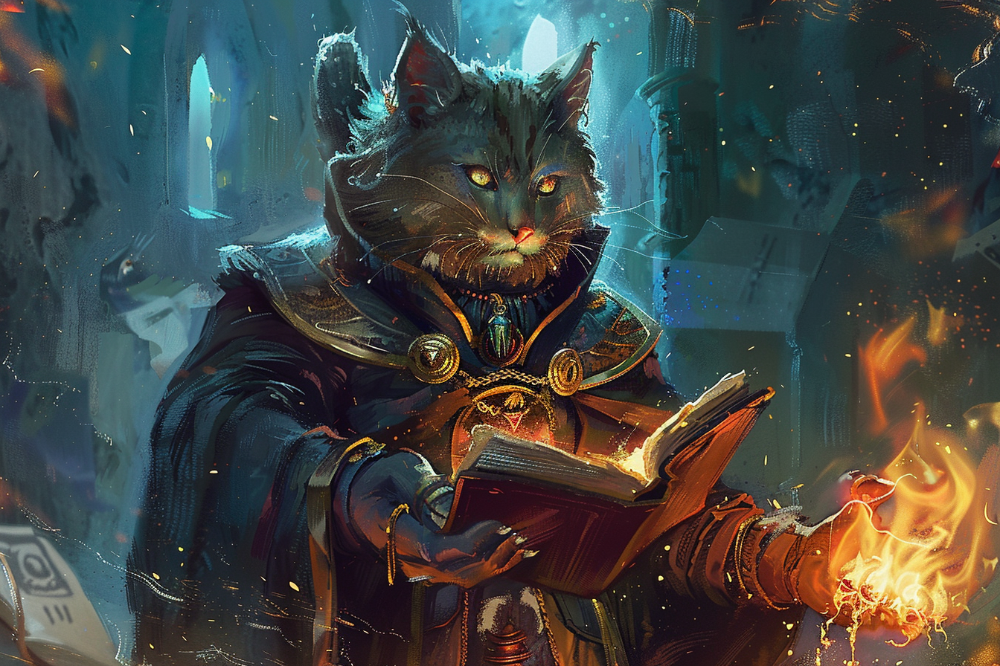

# Create Bonfire - Embrasement

|Ecole|Niveau|Temps d'incantation|Portée|Composantes|Durée|
|-|-|-|-|-|-|
|Invocation|Sort mineur|1 Action|18 m|V S|Concentration, 1 minute|

Vous créez un feu de joie sur un sol visible dans la portée du sort. 

Jusqu'à ce que le sort finisse, le feu de joie magique occupe un cube de 1,50 mètre d'arête. 

Toute créature située à la place du feu de joie lorsque vous lancez le sort doit réussir un **jet de sauvegarde de Dextérité ou subir 1d8 dégâts de feu**. Une créature doit aussi faire un jet de sauvegarde lorsqu'elle se déplace dans l'espace occupé par le feu de joie pour la première fois dans un tour ou si elle termine son tour dans cet espace.
Le feu de joie met le feu aux objets inflammables dans sa zone qui ne sont ni tenus ni portés.

Les dégâts de ce sort augmentent de 1d8 lorsque vous atteignez:
* Le niveau 5 (2d8),
* Le niveau 11 (3d8),
* Le niveau 17 (4d8).