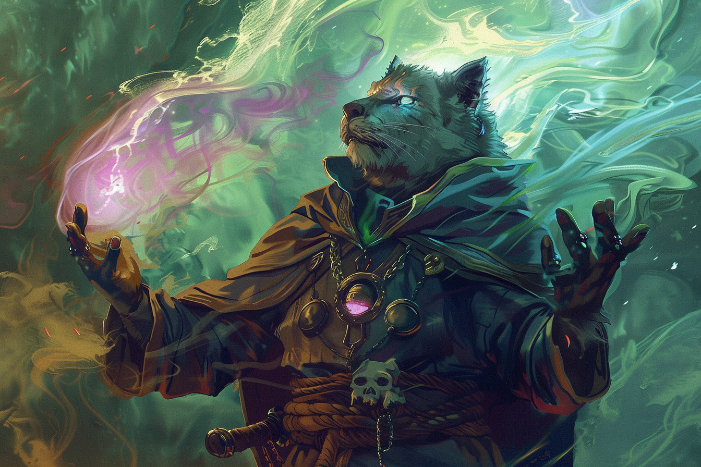

# Mind Sliver - Piqûre mentale

|Ecole|Niveau|Temps d'incantation|Portée|Composantes|Durée|
|-|-|-|-|-|-|
|Enchantement|Sort mineur|1 Action|18 m|V|6 secondes|

Vous injectez une pointe d'énergie psychique désorientante dans l'esprit d'une créature que vous pouvez voir à portée. 

La cible doit effectuer un jet de sauvegarde d'**Intelligence**. En cas d'échec, elle subit 1d6 dégâts psychiques et la première fois qu'elle effectuera **un jet de sauvegarde avant la fin de votre prochain tour**, elle devra lancer un **d4** et soustraire le nombre obtenu du résultat de sa sauvegarde.

Les dégâts de ce sort augmentent de 1d6 lorsque vous atteignez:
* Le niveau 5 (2d6),
* Le niveau 11 (3d6),
* Le niveau 17 (4d6).