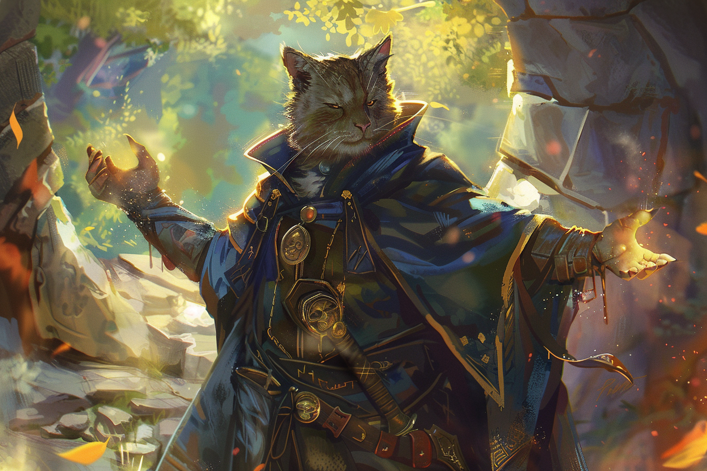

# Minor Illusion - Illusion mineure

|Ecole|Niveau|Temps d'incantation|Portée|Composantes|Durée|
|-|-|-|-|-|-|
|Illusion|Sort mineur|1 Action|9 m|S M|1 minute|

Le lanceur de sorts crée **l'image d'un objet à portée** ou **un son** pendant une minute. Cette illusion se termine également si elle est révoquée au prix d'une action ou si ce sort est lancé une nouvelle fois.

* **Son** : le volume peut aller d'un simple chuchotement à un cri. Il peut s'agir de votre voix, de la voix de quelqu'un d'autre, du rugissement d'un lion, d'un roulement de tambours, ou tout autre son que vous choisissez. Le son peut autant ne pas diminuer en intensité pendant la durée du sort qu'être discret et produit à différents instants dans cet intervalle de temps.

* **Image d'un objet** : l'image ne peut pas être plus large qu'un cube de 1,50 mètre d'arête. Cette image ne peut produire de son, lumière, odeur ou tout autre effet sensoriel. Une interaction physique avec l'image révèle l'illusion, car elle peut être traversée par n'importe quoi.

Si une créature utilise une **action** pour examiner le son ou l'image, elle peut comprendre qu'il s'agit d'une illusion grâce à un jet d'Intelligence (Investigation) contre le DD de sauvegarde de votre sort. Si une créature discerne l'illusion pour ce qu'elle est, l'illusion s'évanouit pour la créature.