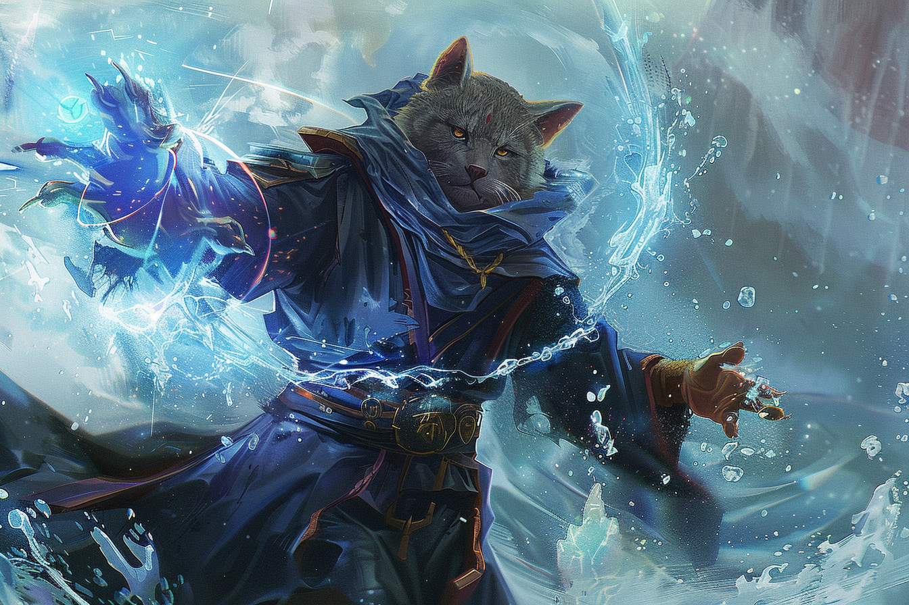

# Shape Water - Façonnage de l'eau

|Ecole|Niveau|Temps d'incantation|Portée|Composantes|Durée|
|-|-|-|-|-|-|
|Transmutation|Sort mineur|1 Action|9m|S|Instantanée / 1 heure|

Vous choisissez une zone couverte d'eau qui peut rentrer dans un cube de 1.5m d'arête, que vous pouvez voir et qui se trouve à portée. Vous pouvez la manipuler de l'une des façons suivantes :
* Vous déplacez l'eau ou en changez le débit dans la direction de votre choix jusqu'à une distance de 1.5m. Ce déplacement n'est pas assez fort pour causer des dégâts ;
* Vous modelez l'eau afin de créer des formes simples qui s'animent selon vos désirs. Ce changement dure 1 heure ;
* Vous changez la couleur ou l'opacité de l'eau. Ce changement est uniforme dans toute l'eau qui vous manipulez et dure 1 heure ;
* Vous gelez l'eau, à condition qu'il n'y ait aucune créature dedans. L'eau dégèle en 1 heure.

Si vous lancez ce sort plusieurs fois : le nombre maximum d'effets non instantanés actifs au même moment est limité à deux : vous pouvez dissiper un tel effet par une action.