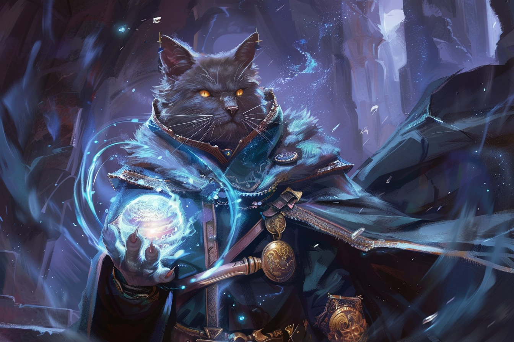

# Chromatic Orb - Orbe chromatique

|Ecole|Niveau|Temps d'incantation|Portée|Composantes|Durée|
|-|-|-|-|-|-|
|Evocation|Niveau 1|1 Action|27 m|V, S, M (diamant de 50 po)|Instantanée|

Vous projetez une sphère d'énergie de 10 cm de diamètre vers une créature que vous pouvez voir dans la portée du sort. 

Vous choisissez:
* Acide
* Foudre
* Feu
* Froid
* Poison
* Tonnerre 

comme type d'orbe que vous créez. V

ous faites ensuite une attaque à distance avec un sort contre la cible. Si l'attaque touche, la créature subit **3d8 dégâts** du type préalablement déterminé.

**Aux niveaux supérieurs** -  Les dégâts augmentent de 1d8 pour chaque niveau d'emplacement au-delà du niveau 1.