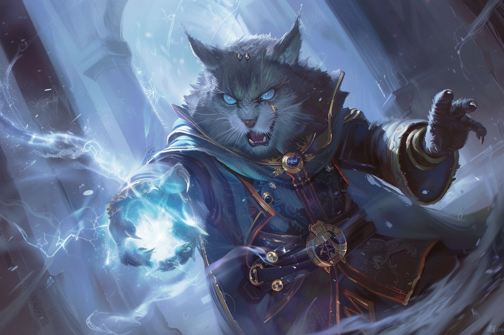

# Dissonant Whispers - Murmures dissonants

|Ecole|Niveau|Temps d'incantation|Portée|Composantes|Durée|
|-|-|-|-|-|-|
|Enchantement|Niveau 1|1 Action|18 m|V|Instantanée|

Vous murmurez une mélodie discordante qui ne peut être entendue que par une créature de votre choix à portée, la tourmentant terriblement. 

La cible doit effectuer un jet de sauvegarde de **Sagesse**. 

* **Echec** : Elle subit **3d6 dégâts psychiques** et doit immédiatement utiliser sa **réaction**, si elle est encore disponible, pour s'éloigner de vous aussi loin que sa vitesse le lui permet. La créature ne se déplace pas vers des sols manifestement dangereux, comme des flammes ou un gouffre. 

* **Réussite** : La cible subit la moitié de ces dégâts et n'est pas contrainte de se déplacer. 

Une créature assourdie réussit automatiquement son jet de sauvegarde.

**Aux niveaux supérieurs** -  Lorsque vous lancez ce sort en utilisant un emplacement de sort de niveau 2 ou supérieur, les dégâts sont augmentés de 1d6 pour chaque niveau d'emplacement au-delà du niveau 1.