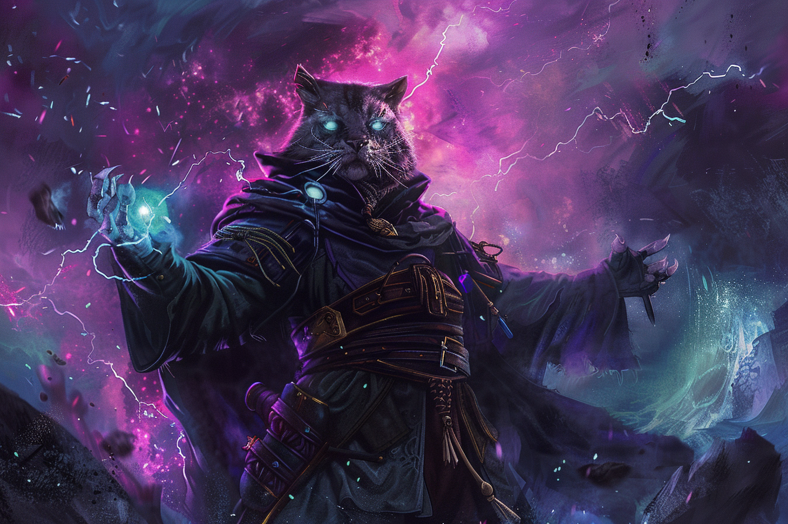

# Thunderwave - Vague Tonnante

|Ecole|Niveau|Temps d'incantation|Portée|Composantes|Durée|
|-|-|-|-|-|-|
|Evocation|Niveau 1|1 Action|Pers.|V S |Instantanée|

Une vague de force de tonnerre émane de vous. Toute créature se trouvant dans un **cube de 4,50 mètres d'arête prenant origine à partir de vous-même** doit effectuer un jet de sauvegarde de **Constitution**. 

En cas d'échec, la créature subit **2d8 dégâts de tonnerre** et est repoussée de **3 mètres** de vous. 

En cas de réussite, elle subit la moitié de ces dégâts et n'est pas repoussée.

En outre, les objets non fixés qui se trouvent entièrement dans la zone d'effet sont automatiquement repoussés de 3 mètres par l'effet du sort, et le sort émet un coup de tonnerre audible jusqu'à **90 mètres**.

*Aux niveaux supérieurs* -  Les dégâts augmentent de 1d8 pour chaque niveau d'emplacement au-delà du niveau 1.