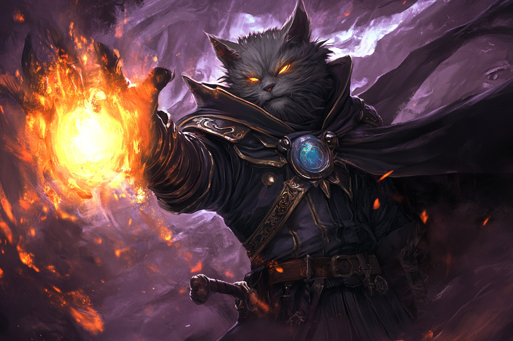

# Tasha's Mind Whip - Fouet Mental de Tasha

|Ecole|Niveau|Temps d'incantation|Portée|Composantes|Durée|
|-|-|-|-|-|-|
|Enchantement|Niveau 2|1 Action|27 m|V|1 round|

Vous fouettez psychiquement l'esprit d'une créature que vous pouvez voir à portée du sort. 

La cible doit effectuer un **jet de sauvegarde d'Intelligence**. 

* *Echec* - Elle subit 3d6 dégâts psychiques et elle ne peut utiliser sa **réaction** avant la fin de son prochain tour. De plus, lors de son prochain tour, elle devra choisir si elle effectue un **mouvement**, une **action** ou une action **bonus** ; elle ne pourra effectuer que l'un des trois. 
* *Réussite* - La cible ne subit que la moitié de ces dégâts et n'est affectée par aucun des autres effets du sort.

*Aux niveaux supérieurs* - Vous pouvez cibler une créature supplémentaire pour chaque niveau d'emplacement supérieur au niveau 2. Les créatures doivent être à 9 mètres ou moins les unes des autres lorsque vous les ciblez.